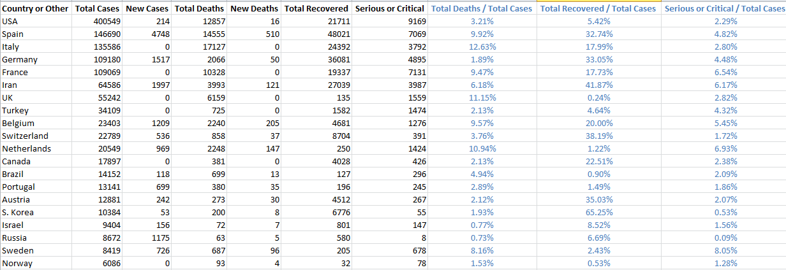

# Worldometer Coronavirus Analysis 

Worldometer [Coronavirus] daily statistics. Analysis of the [Countries] table.

 - 

#### Results - initial version

Just display some rows from the first few columns of interest. (E.g.,  April 02, 2020 around 12 GMT.)

Country: USA, Total Cases: 215357, New Cases: 354, Total Deaths: 5113, New Deaths: 11

Country: Italy, Total Cases: 110574, New Cases: 0, Total Deaths: 13155, New Deaths: 0

Country: Spain, Total Cases: 110238, New Cases: 6120, Total Deaths: 10003, New Deaths: 616

Country: Germany, Total Cases: 78983, New Cases: 1002, Total Deaths: 948, New Deaths: 17

Country: France, Total Cases: 56989, New Cases: 0, Total Deaths: 4032, New Deaths: 0

Country: Iran, Total Cases: 50468, New Cases: 2875, Total Deaths: 3160, New Deaths: 124

Country: UK, Total Cases: 29474, New Cases: 0, Total Deaths: 2352, New Deaths: 0

....

....

#### Results - next iteration

CSV output of headers and rows.

Country - Other, Total Cases, New Cases, Total Deaths, New Deaths

USA, 236072, 21069, 5777, 675

Italy, 115242, 4668, 13915, 760

Spain, 110238, 6120, 10096, 709

Germany, 83459, 5478, 1048, 117

France, 56989, 0, 4032, 0

Iran, 50468, 2875, 3160, 124

UK, 33718, 4244, 2921, 569

....

....

#### Results - Excel output with extra calculated column

Top 20 countries by total cases sorted in descending order by Total Deaths / Total Cases - excluding World

#### Technology

[F# Data Library] for data access, in particular the [HTML Type Provider]. This allows us to "screen scrape" a web page and strongly infer the names and data types in a HTML table, for example. These will then appear in the F# IntelliSense with full type-checking.

[Coronavirus]: <https://www.worldometers.info/coronavirus/>
[Countries]: <https://www.worldometers.info/coronavirus/#countries>
[F# Data Library]: <https://fsharp.github.io/FSharp.Data/>
[HTML Type Provider]: <https://fsharp.github.io/FSharp.Data/library/HtmlProvider.html>